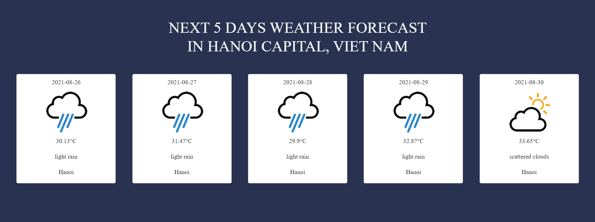

# REPORT OF NEWBIE TEST

## General Information

* Topic: Weather forecast
* Name: Nguyen Quy Minh
* Student-ID: BI10-118

## Task
Build a web page to show weather forecast of the next 5 days. The data should be retrieved from OpenWeatherMap API, and the appropriate information should be displayed in one HTML file, so that it can be viewed by the browser.

## Explaination

### Overview

Here is the HTML ouput:



### Idea

Build a web page to show weather forecast of the next 5 days:
* In 1 default location. (Hanoi)
* At default time : 06:00:00 ( 6AM)
* Informations: Date, Icon (Support for Description), Temperature, Description (Rain, Clouds,...), Location.

#### HTML

Here is HTML code of card presenting weather forecast informations:

```html
<div class="card col-2">
    <div class="text-center mt-2">
        <p class="date0 mb-0"> Date </p>
    </div>
    <div class="weather-container">
        <div class="weather-icon0 d-flex justify-content-center">
            
        </div>
        <div class="temperature-value0">
            <p class="text-center">- °<span>C</span></p>
        </div>
        <div class="temperature-description0">
            <p class="text-center"> - </p>
        </div>
        <div class="location0">
            <p class="text-center">-</p>
        </div>
    </div>
</div>

```
When we have'nt had data yet, HTML presents these unknow elements

#### CSS

Here is CSS

```css
*{
    font-family: 'Besley', serif;;
}

body{
    background-color: #293251;
}

```

#### Javascript

Firstly, i matched html elements to javascript elements by using document.querySelector().

```js
    //SELECT ELEMENTS
    //DAY 1
        // DATE
    const dateElement0 = document.querySelector(".date0");
        // ICON
    const iconElement0 = document.querySelector(".weather-icon0");
        // TEMPERATURE
    const tempElement0 = document.querySelector(".temperature-value0 p");
        // DESCRIPTION
    const descElement0 = document.querySelector(".temperature-description0 p");
        // LOCATION
    const locaElement0 = document.querySelector(".location0 p");
```

The querySelector() allows to find the first element that matches one or more CSS selectors. So here, the selector is class .date0 and the element is:
```html
<p class="date0 mb-0"> Date </p>
```
And the same for another elements and another days.

Then moving to main function to get the weather forecast informations. This fucntion is used for requesting API, recieving repsonse and taking data from it to display in HTML.

```js
    function getWeather(){
    let api = `http://api.openweathermap.org/data/2.5/forecast?q=Hanoi&units=metric&appid=${key}`;

    fetch(api)
        .then(function(response){
            let data = response.json();
            return data;
        })

        .then(function(data){
            for(let i = 0; i <= 39; i++){
                let date_check = data.list[i].dt_txt;
                if (date_check.includes("06:00:00")){
                    let date = data.list[i].dt_txt.replace('06:00:00','');
                    let temp = data.list[i].main.temp;
                    let description = data.list[i].weather[0].description;
                    let iconId = data.list[i].weather[0].icon;
                    let city = data.city.name;
                    arr_weather.push(new weather(date, temp, description, iconId, city));
                }  
            }  
        })
        .then(function(){
            displayWeather();
        })
}       

```

Let start with element "api", it's seted URL with "end" is "http://api.openweathermap.org/data/2.5/forecast?", "q" stands for city, "units" stands for unit of temperature.
Next, "fetch" is a method to request api to receive response( still not data we need) based on "Promise" method. Now when have response we convert it to .json file to use it to next function.
Here, in the next function, i use for loop to go through 40 timestamps, the data.list[i].dt_txt has form "year-month-day XX:XX:XX" i want import the weather forecast at 6AM so "includes" used to check that.
After that, all information of that day will be pushed as a classes to the "arr_weather" for storing.


